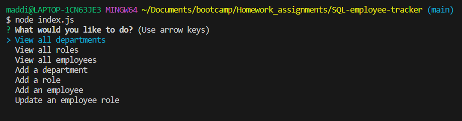
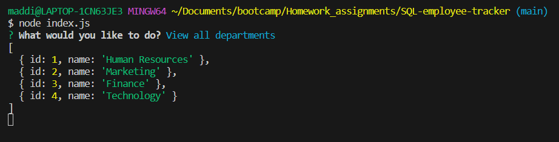

# SQL-employee-tracker

## Description

This employee tracking application is designed to assist in viewing and editing tables with data on employees, their positions, and their departments in the company. By using a simple prompt in the terminal, it offers a simple and organized way for users to view and edit tables. In building this project, I learned how to utilize both inquirer and sql in the same application.

## Installation

To run this project, the user needs to install package.json using the terminal command "npm init -y", inquirer@8.2.4 using the command "npm i inquirer@8.2.4", and sql by using the command "npm i mysql2". 

## Usage

Link to a demonstration of this project and its uses:
https://drive.google.com/file/d/1l5wAMrMlNLwKtMhfYUb_a6fFOYYK4fmm/view 

To use the application, the user must type the command "node index.js" into the terminal. They will then see a quesion prompt, "What would you like to do?" The user may navigate through these answer options by using the up and down arrows, then press the enter button for the action they would like to do. This is shown in screenshot 1, link below.

Once the user hits enter and chooses the action they would like to take, for example, "View all departments", then the information required will pop up, as shows in screenshot 2 below. If the user chooses to edit or add information, more prompts will be added to request those edits.

To exit out of the question prompts in the terminal, press Ctrl or Commmand C.

## Credits

Inquirer and SQL were used to create this application.
